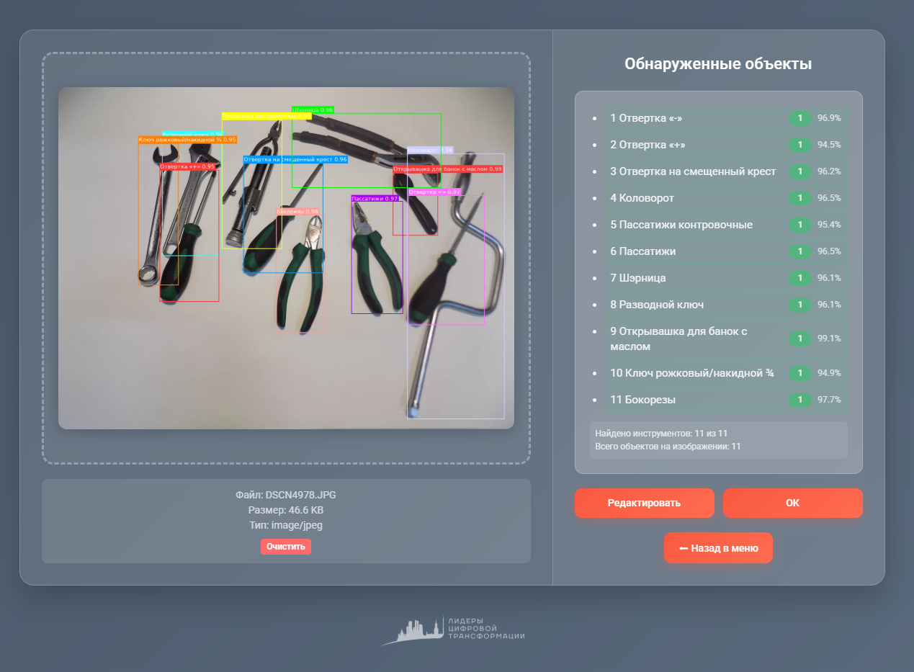
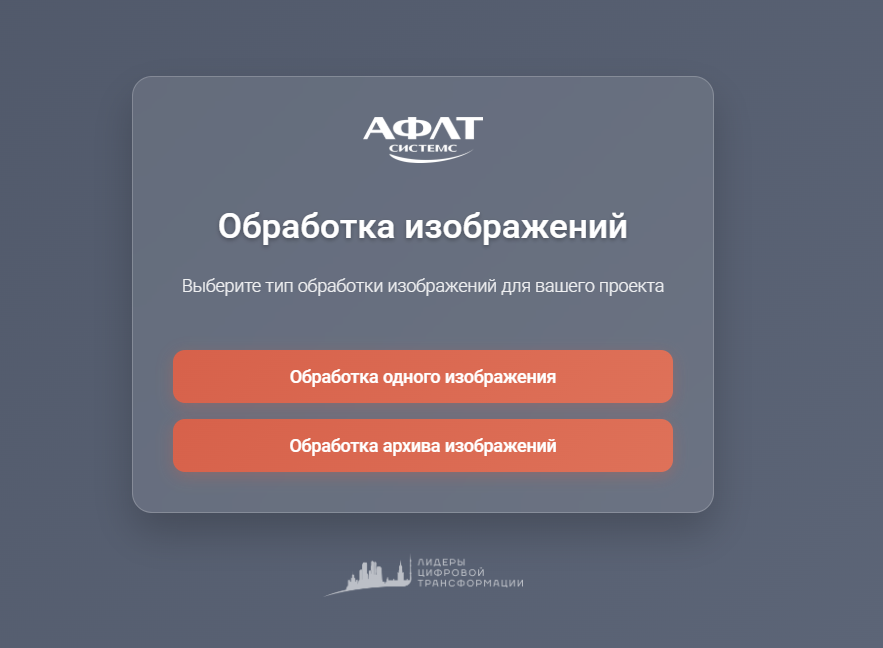
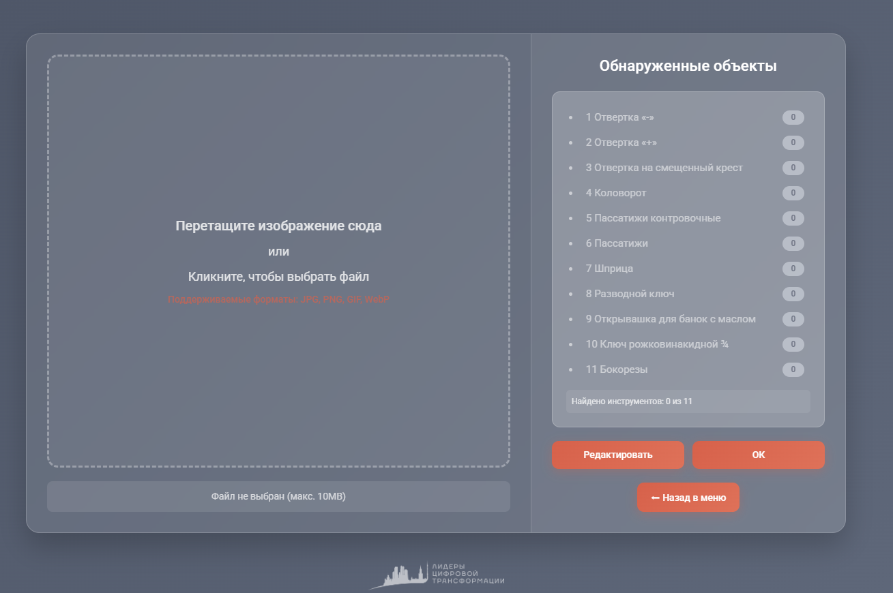
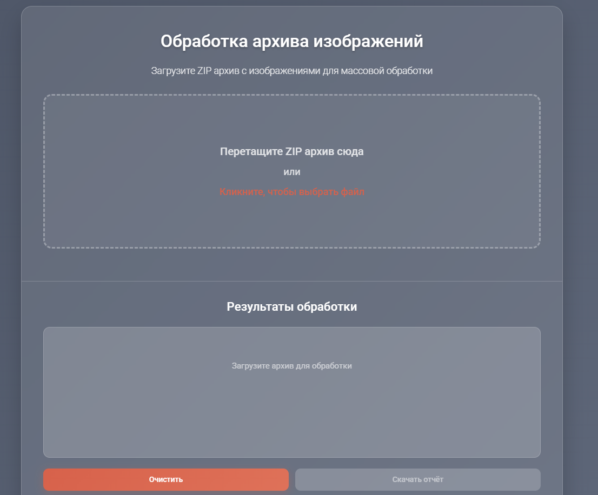

<div align="center">



# 🔧 Kitmatch

**Автоматизированный учёт инструментов по фото.**<br>
Загрузка снимков, детекция YOLO и сохранение результатов в MongoDB.

</div>

---

### ✨ О проекте
Kitmatch — Сервис для автоматизированного учета инструментов: FastAPI backend + React 
frontend + Triton Inference Server (YOLO). 
Поддерживает обработку одиночных 
изображений и ZIP-архивов, очереди через 
RabbitMQ и хранение результатов в MongoDB.

### 🌟 Ключевые возможности
- **🤖 YOLO детекция инструментов**: Модель распознаёт инструменты на фото в реальном времени, без ручного подсчёта и ошибок.
- **🖥️ Triton Inference Server**: Высокопроизводительная подача запросов к модели; масштабирование и низкая задержка инференса.
- **🎨 Удобный фронтенд на React + Vite**: Современный SPA с быстрой сборкой и hot-reload; drag-and-drop загрузка, просмотр и правка результатов в одном интерфейсе.
- **📦 Пакетная обработка (одиночные фото и ZIP)**: Батч-обработка разгружает оператора и ускоряет инвентаризацию.
- **⚡ Асинхронная архитектура на RabbitMQ**: Одна очередь — для запуска моделей (`models`), другая — для сохранения результатов в MongoDB (`postprocessing` → `result`). API сразу отдаёт ответ, тяжёлую работу выполняет в фоне; система не «висит» при пиковых нагрузках.
- **🗄️ Хранение результатов в MongoDB**: Детекции и метаданные сохраняются в документной БД; удобный поиск и история инвентаризаций.
- **🐳 Единый Docker Compose запуск**: Поднимает backend, frontend, MongoDB и RabbitMQ — развёртывание за минуты, без ручной настройки сервисов.
- **🎚️ Настраиваемый confidence_threshold**: Можно подстроить баланс между полнотой распознавания и скоростью под свой сценарий.

## 📸 Обзор

| **Главная страница** | **Обработка одного изображения** |
| :--- | :--- |
|  |  |
| Меню выбора: одно изображение или пакетная загрузка ZIP. | Drag-and-drop или выбор файла; отправка на инференс и просмотр детекций с возможностью правки. |

| **Пакетная обработка** | **Разметка инструментов** |
| :--- | :--- |
|  |  |
| Загрузка ZIP-архива; очередь задач, прогресс и сводка по всем изображениям. | Пример детекции: bbox и подписи классов на фото. |

## 📁 Структура репозитория
```
HackatonLCT2025/
├── backend/                    # FastAPI + очереди + интеграция с Triton
│   ├── kitmatch/src/kitmatch/  # Код приложения
│   ├── docker-compose.yml      # Главный compose для всего стека
│   ├── Dockerfiles/Dockerfile
│   ├── pyproject.toml
│   └── .env                    # Переменные окружения backend (пример добавлен)
├── front/                      # React + Vite, разворачивается через Nginx
├── triton-models-inference/    # Triton Inference Server c YOLO моделью
└── experiments/                # Ноутбуки и скрипты экспериментов
```

## ⚙️ Предусловия
- Docker, Docker Compose
- (Опционально) NVIDIA GPU + NVIDIA Container Toolkit для ускорения Triton

## 🚀 Быстрый старт
1) Создайте внешнюю сеть (нужна для связи backend и triton):
```bash
docker network create shared_network || true
```

2) Запустите Triton Inference Server:
```bash
cd triton-models-inference
docker compose up --build -d
```
По умолчанию Triton доступен как сервис `triton_server` внутри сети `shared_network`.

3) Проверьте/настройте переменные окружения backend (`backend/.env` уже добавлен):
```env
API_PORT_EXTERNAL=8080
API_PORT_INTERNAL=8000
API_HOST=0.0.0.0
APP_ENV=development
MONGODB_URI=mongo_host
MONGO_PORT=27017
RABBITMQ_HOST=rabbit_host
RABBIT_HEARTBEAT_MODELS=600
RABBIT_BLOCKED_CONN_TIMEOUT_MODELS=300
RABBIT_HEARTBEAT_REQUESTS=3000
RABBIT_BLOCKED_CONN_TIMEOUT_REQUESTS=3000
BACKEND__TRITON_URL=http://triton_server:8000
MODEL_NAME="yolo11"
```

4) Запустите весь стек (backend, frontend, MongoDB, RabbitMQ, Dozzle):
```bash
cd backend
docker compose up --build -d
```
Откройте приложение: `http://localhost:8080`.

## 🧭 Как это работает
1. Frontend (React + Nginx) обслуживает UI и проксирует `/api/*` на backend.
2. Backend (FastAPI) принимает изображения, создает задачи в RabbitMQ.
3. Воркеры обращаются к Triton для инференса, результаты сохраняются в MongoDB.
4. UI отображает результаты, поддерживается пакетная обработка `.zip`.

## 📡 Использование API (через Nginx-прокси)
Базовый URL: `http://localhost:8080`

— Загрузка одного изображения:
```bash
curl -X POST http://localhost:8080/api/v1/infer/image \
  -H "Content-Type: multipart/form-data" \
  -F "file=@/path/to/image.jpg" \
  -F "confidence_threshold=0.6"
```

— Загрузка ZIP-архива:
```bash
curl -X POST http://localhost:8080/api/v1/infer/archive \
  -H "Content-Type: multipart/form-data" \
  -F "file=@/path/to/archive.zip" \
  -F "confidence_threshold=0.75" \
  --output results.json
```

Дополнительно:
- `GET /health` — состояние сервиса
- `GET /api/ping` — пинг API

## 🧩 Состав репозитория
- `backend/`: FastAPI, очереди, интеграция Triton, Docker Compose главного стека.
- `front/`: React + Vite, сборка и запуск через Nginx контейнером.
- `triton-models-inference/`: Triton Server, репозиторий моделей, тестовый клиент инференса.
- `experiments/`: эксперименты (YOLO, DINOv3 и т.д.).

## 🛠️ Разработка
- Backend запускается внутри контейнера; зависимости управляются `pyproject.toml`.
- Frontend — стандартный Vite-поток разработки; для продакшена используется Nginx-образ.
- Triton — конфигурация модели в `model_repository/*/config.pbtxt`.

## ❗️ Примечания
- При первом запуске убедитесь, что существует сеть `shared_network`.
- Пути к датасетам/кэшам в Triton compose (host-пути) при необходимости адаптируйте под свою машину.
- Крупные веса/артефакты рекомендуется хранить через Git LFS.
