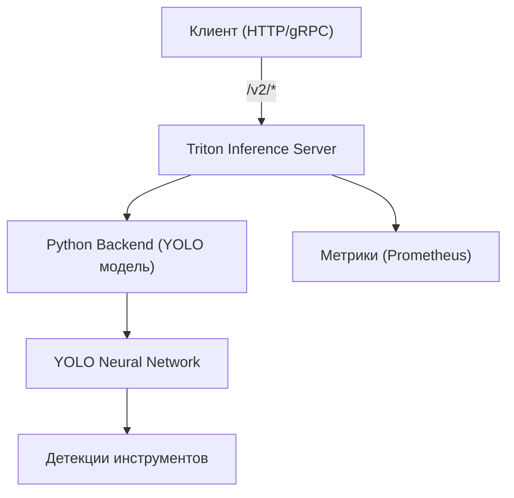

### Models Inference (Triton)
**API для детекции инструментов** — профессиональный сервис инференса на базе NVIDIA Triton Inference Server, предоставляющий REST API для обнаружения инструментов на изображениях с использованием YOLO модели.

## 📜 Оглавление

- [Обзор](#-обзор)
- [Архитектура и схема работы](#-архитектура-и-схема-работы)
- [Структура проекта](#-структура-проекта)
- [Начало работы](#-начало-работы)
- [Проверка работоспособности](#-проверка-работоспособности)
- [Пример инференса](#-пример-инференса)
- [API документация](#-api-документация)
- [Заметки](#-заметки)

## 📖 Обзор

Сервис разворачивает **Triton Inference Server** в Docker-контейнере с **YOLO моделью**, обученной для детекции 11 классов инструментов. API предоставляет HTTP и gRPC интерфейсы для выполнения инференса в реальном времени.

### 🎯 Поддерживаемые классы инструментов

- **Бокорезы**
- **Ключ рожковый/накидной ¾**
- **Коловорот**
- **Отвертка «+»**
- **Отвертка «-»**
- **Отвертка на смещенный крест**
- **Открывашка для банок с маслом**
- **Пассатижи**
- **Пассатижи контровочные**
- **Разводной ключ**
- **Шэрница**

### 🛠️ Ключевые компоненты

- **Triton Inference Server** 🚀: высокопроизводительный сервер инференса с HTTP/gRPC API
- **YOLO модель** 🎯: нейросеть для детекции объектов с поддержкой GPU
- **Python backend** 🐍: обработка запросов и интеграция с YOLO
- **Docker Compose** 🐳: автоматизированное развертывание всего стека

## ⚙️ Архитектура и схема работы



## 📁 Структура проекта

```
triton-models-inference/
├── docker-compose.yml              # Конфигурация Docker Compose
├── model_repository/               # Репозиторий моделей Triton
│   └── yolo/                       # Конфигурация YOLO модели
│       ├── config.pbtxt            # Конфигурация модели
│       └── 1/
│           └── model.py            # Python backend для YOLO
├── models/                         # Python пакет с логикой моделей
│   ├── setup.py                    # Установка пакета
│   └── src/models/
│       └── YOLO/weights/best.pt    # Веса YOLO модели
├── triton_infer_test.py            # Тестовый клиент для инференса
├── requirements.txt                # Зависимости Python
└── README.md                       # Эта документация
```

## 🚀 Начало работы

### Предусловия

- **Docker** и **Docker Compose**
- **NVIDIA GPU** (рекомендуется): драйверы NVIDIA + NVIDIA Container Toolkit
- **CPU** (альтернатива): для CPU-режима уберите GPU конфигурацию в docker-compose.yml

### Быстрый запуск

```bash
# Сборка и запуск сервиса
cd /home/ubuntu/triton-models-inference
docker-compose up --build -d
```

Сервис будет доступен на следующих портах:
- **1339** — HTTP API (основной интерфейс)
- **1340** — gRPC API (высокопроизводительный)
- **1341** — Метрики Prometheus (мониторинг)

### Остановка сервиса

```bash
docker-compose down
```

## ✅ Проверка работоспособности

### Проверка готовности сервера

```bash
curl http://localhost:1339/v2/health/ready
```

### Информация о модели

```bash
curl http://localhost:1339/v2/models/yolo
```

### Список всех моделей

```bash
curl http://localhost:1339/v2/models
```

## 🧪 Пример инференса

### Тестирование с помощью клиентского скрипта

```bash
python3 triton_infer_test.py --image /path/to/image.jpg
```

Скрипт выполнит инференс и сохранит результаты:
- `triton_infer_out/result.json` — JSON с детекциями
- `triton_infer_out/result.jpg` — визуализация с bounding boxes

### Параметры тестового скрипта

```bash
python3 triton_infer_test.py --help

--host HOST          Адрес Triton сервера (по умолчанию: localhost)
--port PORT          Порт Triton сервера (по умолчанию: 1339)  
--model MODEL        Название модели (по умолчанию: yolo)
--image IMAGE        Путь к изображению для тестирования
--out_json OUT_JSON  Путь для сохранения JSON результатов
--out_vis OUT_VIS    Путь для сохранения визуализации
```

## 📡 API документация

### Формат входных данных

- **`image`**: UINT8 тензор с изображением в формате `[H, W, C]`

### Формат выходных данных

- **`bboxes`**: JSON строка с массивом детекций:

```json
[
  {
    "bbox": [x1, y1, x2, y2],
    "confidence": 0.95,
    "class": "Пассатижи",
    "class_id": 7
  }
]
```

### Пример HTTP запроса

```bash
curl -X POST http://localhost:1339/v2/models/yolo/infer \
  -H 'Content-Type: application/json' \
  -d '{
        "inputs": [
          {
            "name": "image",
            "datatype": "UINT8",
            "shape": [640, 640, 3],
            "data": [/* бинарные данные изображения */]
          }
        ]
      }'
```

### Параметры модели

Модель поддерживает настройку через параметры в `config.pbtxt`:

- **`conf_threshold`**: порог уверенности (по умолчанию: 0.5)
- **`iou_threshold`**: порог IoU для NMS (по умолчанию: 0.45)
- **`classes`**: список классов для детекции

## 📝 Заметки

### Производительность

- **GPU ускорение**: сервис автоматически использует GPU при наличии
- **Базовая модель**: YOLO модель оптимизирована для детекции инструментов
- **Масштабирование**: Triton поддерживает горизонтальное масштабирование

### Разработка

- **Editable установка**: пакет `models/` монтируется в editable режиме
- **Горячая перезагрузка**: изменения в коде применяются без перезапуска контейнера
- **Логирование**: подробные логи для отладки и мониторинга

### Конфигурация

- В `config.pbtxt` используется `KIND_AUTO` для автоматического выбора CPU/GPU
- Для CPU-режима уберите блок `deploy.resources.devices` в docker-compose.yml
- Порт метрик Prometheus доступен для интеграции с системами мониторинга


